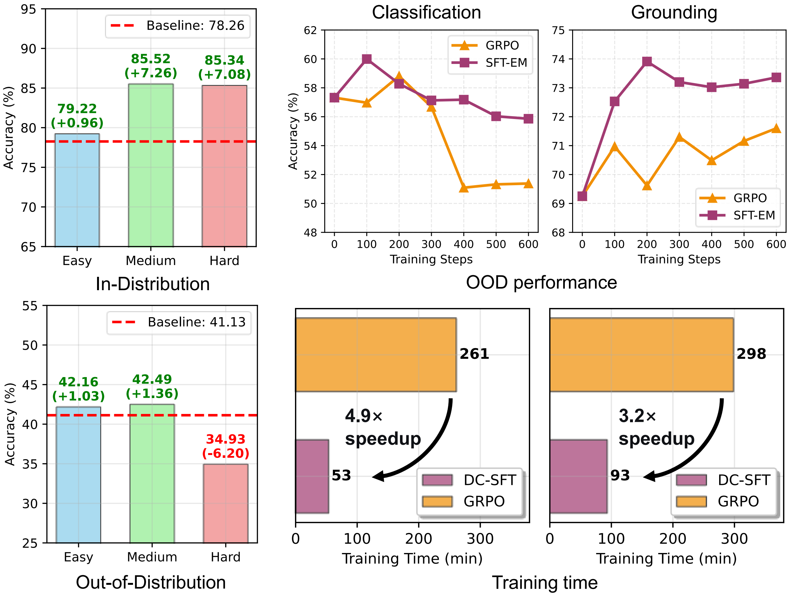

<div align="center">
<h1> Why Does RL Generalize Better Than SFT? A Data-Centric Perspective on VLM Post-Training
</h1>
<div>
    <a>Aojun Lu</a>&emsp;
    <a target='_blank'>Tao Feng</a>&emsp;
    <a href='https://jacobyuan7.github.io/' target='_blank'>Hangjie Yuan</a>&emsp;
    <a>Wei Li</a>&emsp;
    <a href='https://yn-sun.github.io/' target='_blank'>Yanan Sun&#9993</a>&emsp;
</div>
<strong>Accepted to <a href='https://cvpr.thecvf.com/Conferences/2026' target='_blank'>CVPR 2026</a> :partying_face:</strong>

[](https://arxiv.org/abs/2602.10815)
[](https://github.com/byyx666/DC-SFT)
[](https://github.com/byyx666/DC-SFT)

</div>



> Abstract:
> The adaptation of large-scale Vision-Language Models (VLMs) through post-training reveals a pronounced generalization gap: models fine-tuned with Reinforcement Learning (RL) consistently achieve superior out-of-distribution (OOD) performance compared to those trained with Supervised Fine-Tuning (SFT). This paper posits a data-centric explanation for this phenomenon, contending that RL's generalization advantage arises from an implicit data filtering mechanism that inherently prioritizes medium-difficulty training samples. To test this hypothesis, we systematically evaluate the OOD generalization of SFT models across training datasets of varying difficulty levels. Our results confirm that data difficulty is a critical factor, revealing that training on hard samples significantly degrades OOD performance. Motivated by this finding, we introduce Difficulty-Curated SFT (DC-SFT), a straightforward method that explicitly filters the training set based on sample difficulty. Experiments show that DC-SFT not only substantially enhances OOD generalization over standard SFT, but also surpasses the performance of RL-based training, all while providing greater stability and computational efficiency. This work offers a data-centric account of the OOD generalization gap in VLMs and establishes a more efficient pathway to achieving robust generalization.


## 🚀 Quick Start Guide

Welcome! Below are the minimal steps to get the project running.

### ⚠️ Before You Start

This guide introduces the core directories:

- **`data/`**: Stores training and testing data (excluding raw data). 
  - Filenames containing `val` indicate test data.
  - `cold` denotes data for cold start.
  - `sft` denotes data for SFT training.
  - `grpo` denotes data for reinforcement learning training.
  - `easy`, `middle`, `hard` indicate data filtered by different difficulty levels.

- **`example/`**: Contains training scripts under the `train` subdirectory.
  - `cold_start_full.sh` – for cold start
  - `sft_lora.sh` – standard SFT
  - `grpo_lora.sh` – reinforcement learning using the GRPO algorithm
  - `sft_middle_lora.sh` – SFT using medium-difficulty data (referred to as SFT-M in the paper)
  - `export/merge_lora.sh` – for merging LoRA modules with the base model

- **`infer/`**: Contains two files:
  - `test_dp.py` – used for (1) generating multiple responses from the cold-started model for training data, preparing for difficulty-based data filtering, and (2) evaluating model performance before and after training.
  - `sample.py` – used to filter low, medium, and high-difficulty data based on multiple responses generated by the cold-started model.

If there are any questions, please feel free to open an issue or contact the author: **Aojun Lu** ([aojunlu@stu.scu.edu.cn](mailto:aojunlu@stu.scu.edu.cn))

### 1️⃣ Install Datasets and Models

Please install the following datasets and models and adjust the paths within the training data (JSON) and training scripts (SH):

- **[ImageNet](https://image-net.org/download.php)**
- **[ImageNet-R](https://github.com/hendrycks/imagenet-r)**
- **[ImageNet-A](https://github.com/hendrycks/natural-adv-examples)**
- **[Qwen2.5-VL-3B/7B](https://huggingface.co/Qwen/Qwen2.5-VL-3B-Instruct)**

### 2️⃣ Install Dependencies

Please refer to **[ms-swift](https://github.com/modelscope/ms-swift)** to install the dependencies.

### 3️⃣ Ensure All Paths Are Correct

Verify that all dataset, model, and script paths are correctly configured before running.

### 4️⃣ Training

```bash
# Step 1: Cold start
bash examples/cold_start_full.sh

# Step 2: SFT with medium-difficulty data (SFT-M)
bash examples/sft_middle_lora.sh
```

### 5️⃣ Evaluation

```bash
torchrun --nproc_per_node=2 --master_port=29600 ./infer/test_dp.py
```

⭐ **If this repo helps your research, please give it a star!** ⭐

## Citation

If you find this repo useful, please consider citing our paper.
```bibtex
@misc{lu2026does,
  title={Why Does RL Generalize Better Than SFT? A Data-Centric Perspective on VLM Post-Training},
  author={Lu, Aojun and Feng, Tao and Yuan, Hangjie and Li, Wei and Sun, Yanan},
  journal={CVPR},
  year={2026}
}
```

## Acknowledgement

The code implementation is based on the open-source library [ms-swift](https://github.com/modelscope/ms-swift).